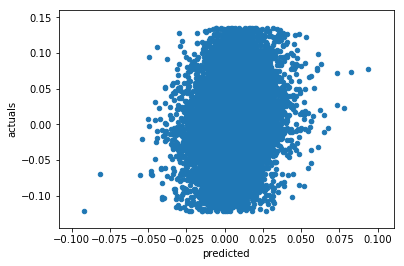
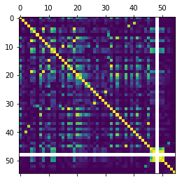
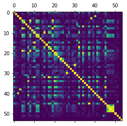

# Zillow machine learning algorithm

This project aims to predict zillow housing price estimates. It will utilize the pandas and Scikit-learn packages from python 3.6 to attempt to create a better algorithm than Zillow already has implemented. The data was distributed from Zillow via kaggle.com 

main packages: Pandas, numpy, Sklearn, and matplotlib


```python
#time script
from datetime import datetime
startTime = datetime.now()
```


```python
import pandas as pd
import numpy as np
from sklearn.decomposition import PCA
from sklearn.ensemble import RandomForestRegressor
from sklearn.feature_selection import RFE
from sklearn.model_selection import RandomizedSearchCV
from time import time
from scipy.stats import randint as sp_randint
import matplotlib.pyplot as plt
%matplotlib inline
```


```python
raw_results=pd.read_csv('C:/Users/Will/Documents/Regis/MSDS692/train_2016_v2.csv/train_2016_v2.csv')
raw_properties=pd.read_csv('C:/Users/Will/Documents/Regis/MSDS692/properties_2016.csv/properties_2016.csv',low_memory=False)
```


```python
raw_properties_combined=raw_properties.merge(raw_results,how='inner',on='parcelid')
print(len(raw_properties))
```

    2985217
    

## Feature engineering for training  
Will extract month from transaction date to use for training, saw some improvement with this feature.


```python
dates=pd.to_datetime(raw_properties_combined['transactiondate'])
#dates.head(n=5)
raw_properties_combined['Month']=dates.dt.month
```

## Model type

The zillow model is defined as the log of the zillow estimate to the log of the actual sale price, the competition is to determine what the computed error will be. This can be seen below. An initial challenge of this project is that the sale date can not be used as an input, where a forecasted multiplier might be useful, however the date of transactions is useful. The training data set contains 90K transactions, for model testing this will be broken into a random sample based on a 70:30 split.


```python
raw_results.head(n=5)
len(raw_results)
```


    90275


```python
raw_properties.head(n=5)
```


<div>
<style>
    .dataframe thead tr:only-child th {
        text-align: right;
    }

    .dataframe thead th {
        text-align: left;
    }

    .dataframe tbody tr th {
        vertical-align: top;
    }
</style>
<table border="1" class="dataframe">
  <thead>
    <tr style="text-align: right;">
      <th></th>
      <th>parcelid</th>
      <th>airconditioningtypeid</th>
      <th>architecturalstyletypeid</th>
      <th>basementsqft</th>
      <th>bathroomcnt</th>
      <th>bedroomcnt</th>
      <th>buildingclasstypeid</th>
      <th>buildingqualitytypeid</th>
      <th>calculatedbathnbr</th>
      <th>decktypeid</th>
      <th>...</th>
      <th>numberofstories</th>
      <th>fireplaceflag</th>
      <th>structuretaxvaluedollarcnt</th>
      <th>taxvaluedollarcnt</th>
      <th>assessmentyear</th>
      <th>landtaxvaluedollarcnt</th>
      <th>taxamount</th>
      <th>taxdelinquencyflag</th>
      <th>taxdelinquencyyear</th>
      <th>censustractandblock</th>
    </tr>
  </thead>
  <tbody>
    <tr>
      <th>0</th>
      <td>10754147</td>
      <td>NaN</td>
      <td>NaN</td>
      <td>NaN</td>
      <td>0.0</td>
      <td>0.0</td>
      <td>NaN</td>
      <td>NaN</td>
      <td>NaN</td>
      <td>NaN</td>
      <td>...</td>
      <td>NaN</td>
      <td>NaN</td>
      <td>NaN</td>
      <td>9.0</td>
      <td>2015.0</td>
      <td>9.0</td>
      <td>NaN</td>
      <td>NaN</td>
      <td>NaN</td>
      <td>NaN</td>
    </tr>
    <tr>
      <th>1</th>
      <td>10759547</td>
      <td>NaN</td>
      <td>NaN</td>
      <td>NaN</td>
      <td>0.0</td>
      <td>0.0</td>
      <td>NaN</td>
      <td>NaN</td>
      <td>NaN</td>
      <td>NaN</td>
      <td>...</td>
      <td>NaN</td>
      <td>NaN</td>
      <td>NaN</td>
      <td>27516.0</td>
      <td>2015.0</td>
      <td>27516.0</td>
      <td>NaN</td>
      <td>NaN</td>
      <td>NaN</td>
      <td>NaN</td>
    </tr>
    <tr>
      <th>2</th>
      <td>10843547</td>
      <td>NaN</td>
      <td>NaN</td>
      <td>NaN</td>
      <td>0.0</td>
      <td>0.0</td>
      <td>NaN</td>
      <td>NaN</td>
      <td>NaN</td>
      <td>NaN</td>
      <td>...</td>
      <td>NaN</td>
      <td>NaN</td>
      <td>650756.0</td>
      <td>1413387.0</td>
      <td>2015.0</td>
      <td>762631.0</td>
      <td>20800.37</td>
      <td>NaN</td>
      <td>NaN</td>
      <td>NaN</td>
    </tr>
    <tr>
      <th>3</th>
      <td>10859147</td>
      <td>NaN</td>
      <td>NaN</td>
      <td>NaN</td>
      <td>0.0</td>
      <td>0.0</td>
      <td>3.0</td>
      <td>7.0</td>
      <td>NaN</td>
      <td>NaN</td>
      <td>...</td>
      <td>1.0</td>
      <td>NaN</td>
      <td>571346.0</td>
      <td>1156834.0</td>
      <td>2015.0</td>
      <td>585488.0</td>
      <td>14557.57</td>
      <td>NaN</td>
      <td>NaN</td>
      <td>NaN</td>
    </tr>
    <tr>
      <th>4</th>
      <td>10879947</td>
      <td>NaN</td>
      <td>NaN</td>
      <td>NaN</td>
      <td>0.0</td>
      <td>0.0</td>
      <td>4.0</td>
      <td>NaN</td>
      <td>NaN</td>
      <td>NaN</td>
      <td>...</td>
      <td>NaN</td>
      <td>NaN</td>
      <td>193796.0</td>
      <td>433491.0</td>
      <td>2015.0</td>
      <td>239695.0</td>
      <td>5725.17</td>
      <td>NaN</td>
      <td>NaN</td>
      <td>NaN</td>
    </tr>
  </tbody>
</table>
<p>5 rows × 58 columns</p>
</div>


## Data Set Initial Challenges

Many features are missing for most of the properties. The first attempt at this model will be to remove any feature which does not have at least 90% of the values. Some imputation will be attempted on those values, and then depending on the outcome more of the low count observations will be removed. 


```python
raw_properties_combined.isnull().sum()/len(raw_properties_combined)
```


    parcelid                        0.000000
    airconditioningtypeid           0.681185
    architecturalstyletypeid        0.997109
    basementsqft                    0.999524
    bathroomcnt                     0.000000
    bedroomcnt                      0.000000
    buildingclasstypeid             0.999823
    buildingqualitytypeid           0.364564
    calculatedbathnbr               0.013093
    decktypeid                      0.992711
    finishedfloor1squarefeet        0.924054
    calculatedfinishedsquarefeet    0.007322
    finishedsquarefeet12            0.051831
    finishedsquarefeet13            0.999634
    finishedsquarefeet15            0.960521
    finishedsquarefeet50            0.924054
    finishedsquarefeet6             0.995336
    fips                            0.000000
    fireplacecnt                    0.893581
    fullbathcnt                     0.013093
    garagecarcnt                    0.668380
    garagetotalsqft                 0.668380
    hashottuborspa                  0.973802
    heatingorsystemtypeid           0.378787
    latitude                        0.000000
    longitude                       0.000000
    lotsizesquarefeet               0.112434
    poolcnt                         0.801706
    poolsizesum                     0.989266
    pooltypeid10                    0.987139
                                      ...   
    pooltypeid7                     0.815043
    propertycountylandusecode       0.000011
    propertylandusetypeid           0.000000
    propertyzoningdesc              0.354052
    rawcensustractandblock          0.000000
    regionidcity                    0.019972
    regionidcounty                  0.000000
    regionidneighborhood            0.601086
    regionidzip                     0.000388
    roomcnt                         0.000000
    storytypeid                     0.999524
    threequarterbathnbr             0.866973
    typeconstructiontypeid          0.996688
    unitcnt                         0.353608
    yardbuildingsqft17              0.970690
    yardbuildingsqft26              0.998948
    yearbuilt                       0.008374
    numberofstories                 0.772141
    fireplaceflag                   0.997541
    structuretaxvaluedollarcnt      0.004209
    taxvaluedollarcnt               0.000011
    assessmentyear                  0.000000
    landtaxvaluedollarcnt           0.000011
    taxamount                       0.000066
    taxdelinquencyflag              0.980249
    taxdelinquencyyear              0.980249
    censustractandblock             0.006702
    logerror                        0.000000
    transactiondate                 0.000000
    Month                           0.000000
    Length: 61, dtype: float64


```python
#properties90=raw_properties_combined.dropna(thresh=.1*len(raw_properties_combined),axis=1)
properties90=raw_properties_combined
original_set=len(properties90)
```

## Data imputation

Missing values are imputed using the value -1


```python
prop90med=pd.DataFrame(properties90.median())
```


```python
pca_frame=properties90.select_dtypes([np.number])
#first attempt at imputation
#pca_frame=pca_frame.apply(lambda x: x.fillna(x.median()),axis=0)
pca_frame=pca_frame.apply(lambda x: x.fillna(-1),axis=0)


pca_frame.head(n=5)
```


<div>
<style>
    .dataframe thead tr:only-child th {
        text-align: right;
    }

    .dataframe thead th {
        text-align: left;
    }

    .dataframe tbody tr th {
        vertical-align: top;
    }
</style>
<table border="1" class="dataframe">
  <thead>
    <tr style="text-align: right;">
      <th></th>
      <th>parcelid</th>
      <th>airconditioningtypeid</th>
      <th>architecturalstyletypeid</th>
      <th>basementsqft</th>
      <th>bathroomcnt</th>
      <th>bedroomcnt</th>
      <th>buildingclasstypeid</th>
      <th>buildingqualitytypeid</th>
      <th>calculatedbathnbr</th>
      <th>decktypeid</th>
      <th>...</th>
      <th>numberofstories</th>
      <th>structuretaxvaluedollarcnt</th>
      <th>taxvaluedollarcnt</th>
      <th>assessmentyear</th>
      <th>landtaxvaluedollarcnt</th>
      <th>taxamount</th>
      <th>taxdelinquencyyear</th>
      <th>censustractandblock</th>
      <th>logerror</th>
      <th>Month</th>
    </tr>
  </thead>
  <tbody>
    <tr>
      <th>0</th>
      <td>17073783</td>
      <td>-1.0</td>
      <td>-1.0</td>
      <td>-1.0</td>
      <td>2.5</td>
      <td>3.0</td>
      <td>-1.0</td>
      <td>-1.0</td>
      <td>2.5</td>
      <td>-1.0</td>
      <td>...</td>
      <td>2.0</td>
      <td>115087.0</td>
      <td>191811.0</td>
      <td>2015.0</td>
      <td>76724.0</td>
      <td>2015.06</td>
      <td>-1.0</td>
      <td>6.111002e+13</td>
      <td>0.0953</td>
      <td>1</td>
    </tr>
    <tr>
      <th>1</th>
      <td>17088994</td>
      <td>-1.0</td>
      <td>-1.0</td>
      <td>-1.0</td>
      <td>1.0</td>
      <td>2.0</td>
      <td>-1.0</td>
      <td>-1.0</td>
      <td>1.0</td>
      <td>-1.0</td>
      <td>...</td>
      <td>1.0</td>
      <td>143809.0</td>
      <td>239679.0</td>
      <td>2015.0</td>
      <td>95870.0</td>
      <td>2581.30</td>
      <td>-1.0</td>
      <td>6.111002e+13</td>
      <td>0.0198</td>
      <td>3</td>
    </tr>
    <tr>
      <th>2</th>
      <td>17100444</td>
      <td>-1.0</td>
      <td>-1.0</td>
      <td>-1.0</td>
      <td>2.0</td>
      <td>3.0</td>
      <td>-1.0</td>
      <td>-1.0</td>
      <td>2.0</td>
      <td>-1.0</td>
      <td>...</td>
      <td>1.0</td>
      <td>33619.0</td>
      <td>47853.0</td>
      <td>2015.0</td>
      <td>14234.0</td>
      <td>591.64</td>
      <td>-1.0</td>
      <td>6.111001e+13</td>
      <td>0.0060</td>
      <td>5</td>
    </tr>
    <tr>
      <th>3</th>
      <td>17102429</td>
      <td>-1.0</td>
      <td>-1.0</td>
      <td>-1.0</td>
      <td>1.5</td>
      <td>2.0</td>
      <td>-1.0</td>
      <td>-1.0</td>
      <td>1.5</td>
      <td>-1.0</td>
      <td>...</td>
      <td>1.0</td>
      <td>45609.0</td>
      <td>62914.0</td>
      <td>2015.0</td>
      <td>17305.0</td>
      <td>682.78</td>
      <td>-1.0</td>
      <td>6.111001e+13</td>
      <td>-0.0566</td>
      <td>6</td>
    </tr>
    <tr>
      <th>4</th>
      <td>17109604</td>
      <td>-1.0</td>
      <td>-1.0</td>
      <td>-1.0</td>
      <td>2.5</td>
      <td>4.0</td>
      <td>-1.0</td>
      <td>-1.0</td>
      <td>2.5</td>
      <td>-1.0</td>
      <td>...</td>
      <td>2.0</td>
      <td>277000.0</td>
      <td>554000.0</td>
      <td>2015.0</td>
      <td>277000.0</td>
      <td>5886.92</td>
      <td>-1.0</td>
      <td>6.111001e+13</td>
      <td>0.0573</td>
      <td>8</td>
    </tr>
  </tbody>
</table>
<p>5 rows × 55 columns</p>
</div>


## PCA analysis


```python
pca_analysis=pca_frame.drop('logerror',1)
pca = PCA(n_components=10)
pca_r = pca.fit(pca_frame)
print(str(pca_r.explained_variance_ratio_))


```

    [  1.00000000e+00   2.57990152e-13   1.99377356e-14   6.85993510e-15
       1.48127077e-15   1.06645819e-15   8.77016162e-16   5.83621188e-16
       5.06032447e-16   8.81106317e-17]
    

This PCA result is very enteresting. Because the first principle component explains all of the observed variance we can assume that a linear model should be able to fit well with the data set.

## Random forest ensemble

Will use the sklearn package to fit a random forest to the data set. Will remove outliers to help the model, may use machine learning, but to start will use the IQR method.IQR eliminates outliers out side of 1.5 times the inner quartile range.


```python
Q3=pca_frame['logerror'].quantile(q=.75)
print(Q3)
Q1=pca_frame['logerror'].quantile(q=.25)
print(Q1)
IQR=Q3-Q1
print(IQR)

pca_frame=pca_frame[(pca_frame['logerror']<=Q3+1.5*IQR) & (pca_frame['logerror']>=Q1-1.5*IQR)]
#ca_frame=pca_frame[(pca_frame['logerror']<=.4) & (pca_frame['logerror']>=-.43)]
per_dropped=len(pca_frame)/original_set
print(per_dropped)
pca_frame.head(n=5)
```

    0.0392
    -0.0253
    0.0645
    0.8828247022985323
    


<div>
<style>
    .dataframe thead tr:only-child th {
        text-align: right;
    }

    .dataframe thead th {
        text-align: left;
    }

    .dataframe tbody tr th {
        vertical-align: top;
    }
</style>
<table border="1" class="dataframe">
  <thead>
    <tr style="text-align: right;">
      <th></th>
      <th>parcelid</th>
      <th>airconditioningtypeid</th>
      <th>architecturalstyletypeid</th>
      <th>basementsqft</th>
      <th>bathroomcnt</th>
      <th>bedroomcnt</th>
      <th>buildingclasstypeid</th>
      <th>buildingqualitytypeid</th>
      <th>calculatedbathnbr</th>
      <th>decktypeid</th>
      <th>...</th>
      <th>numberofstories</th>
      <th>structuretaxvaluedollarcnt</th>
      <th>taxvaluedollarcnt</th>
      <th>assessmentyear</th>
      <th>landtaxvaluedollarcnt</th>
      <th>taxamount</th>
      <th>taxdelinquencyyear</th>
      <th>censustractandblock</th>
      <th>logerror</th>
      <th>Month</th>
    </tr>
  </thead>
  <tbody>
    <tr>
      <th>0</th>
      <td>17073783</td>
      <td>-1.0</td>
      <td>-1.0</td>
      <td>-1.0</td>
      <td>2.5</td>
      <td>3.0</td>
      <td>-1.0</td>
      <td>-1.0</td>
      <td>2.5</td>
      <td>-1.0</td>
      <td>...</td>
      <td>2.0</td>
      <td>115087.0</td>
      <td>191811.0</td>
      <td>2015.0</td>
      <td>76724.0</td>
      <td>2015.06</td>
      <td>-1.0</td>
      <td>6.111002e+13</td>
      <td>0.0953</td>
      <td>1</td>
    </tr>
    <tr>
      <th>1</th>
      <td>17088994</td>
      <td>-1.0</td>
      <td>-1.0</td>
      <td>-1.0</td>
      <td>1.0</td>
      <td>2.0</td>
      <td>-1.0</td>
      <td>-1.0</td>
      <td>1.0</td>
      <td>-1.0</td>
      <td>...</td>
      <td>1.0</td>
      <td>143809.0</td>
      <td>239679.0</td>
      <td>2015.0</td>
      <td>95870.0</td>
      <td>2581.30</td>
      <td>-1.0</td>
      <td>6.111002e+13</td>
      <td>0.0198</td>
      <td>3</td>
    </tr>
    <tr>
      <th>2</th>
      <td>17100444</td>
      <td>-1.0</td>
      <td>-1.0</td>
      <td>-1.0</td>
      <td>2.0</td>
      <td>3.0</td>
      <td>-1.0</td>
      <td>-1.0</td>
      <td>2.0</td>
      <td>-1.0</td>
      <td>...</td>
      <td>1.0</td>
      <td>33619.0</td>
      <td>47853.0</td>
      <td>2015.0</td>
      <td>14234.0</td>
      <td>591.64</td>
      <td>-1.0</td>
      <td>6.111001e+13</td>
      <td>0.0060</td>
      <td>5</td>
    </tr>
    <tr>
      <th>3</th>
      <td>17102429</td>
      <td>-1.0</td>
      <td>-1.0</td>
      <td>-1.0</td>
      <td>1.5</td>
      <td>2.0</td>
      <td>-1.0</td>
      <td>-1.0</td>
      <td>1.5</td>
      <td>-1.0</td>
      <td>...</td>
      <td>1.0</td>
      <td>45609.0</td>
      <td>62914.0</td>
      <td>2015.0</td>
      <td>17305.0</td>
      <td>682.78</td>
      <td>-1.0</td>
      <td>6.111001e+13</td>
      <td>-0.0566</td>
      <td>6</td>
    </tr>
    <tr>
      <th>4</th>
      <td>17109604</td>
      <td>-1.0</td>
      <td>-1.0</td>
      <td>-1.0</td>
      <td>2.5</td>
      <td>4.0</td>
      <td>-1.0</td>
      <td>-1.0</td>
      <td>2.5</td>
      <td>-1.0</td>
      <td>...</td>
      <td>2.0</td>
      <td>277000.0</td>
      <td>554000.0</td>
      <td>2015.0</td>
      <td>277000.0</td>
      <td>5886.92</td>
      <td>-1.0</td>
      <td>6.111001e+13</td>
      <td>0.0573</td>
      <td>8</td>
    </tr>
  </tbody>
</table>
<p>5 rows × 55 columns</p>
</div>


```python
rand_data=np.random.rand(len(pca_frame))<.8
trainset=pca_frame[rand_data]
testset=pca_frame[~rand_data]
print (len(trainset))
print (len(testset))

train_val=trainset['logerror']
test_val=testset['logerror']

trainset=trainset.drop('logerror',1)
testset=testset.drop('logerror',1)

trainset=trainset.drop('fireplacecnt',1) #advice from a Kaggle user
testset=testset.drop('fireplacecnt',1)

test_val=test_val.reset_index(drop=True)
```

    64068
    15629
    


```python
forest_model=RandomForestRegressor(n_estimators=3000,random_state=1234)
```


```python
forest_fit=forest_model.fit(trainset,train_val)
fitted_vals=pd.DataFrame(forest_fit.predict(testset))
```

cross validation randomized search


```python
def report(results, n_top=5):
    for i in range(1, n_top + 1):
        candidates = np.flatnonzero(results['rank_test_score'] == i)
        for candidate in candidates:
            print("Model with rank: {0}".format(i))
            print("Mean validation score: {0:.3f} (std: {1:.3f})".format(
                  results['mean_test_score'][candidate],
                  results['std_test_score'][candidate]))
            print("Parameters: {0}".format(results['params'][candidate]))
            print("")


# specify parameters and distributions to sample from
param_dist = {"max_depth": [10, None],
              "max_features": sp_randint(1, 20),
              "min_samples_leaf": sp_randint(1, 20),
              "bootstrap": [True, False],}

# run randomized search
n_iter_search = 60
random_search = RandomizedSearchCV(forest_model, param_distributions=param_dist,
                                   n_iter=n_iter_search)
start = time()
random_search.fit(trainset,train_val)
print("RandomizedSearchCV took %.2f seconds for %d candidates"
      " parameter settings." % ((time() - start), n_iter_search))
report(random_search.cv_results_)
```

    RandomizedSearchCV took 68781.48 seconds for 60 candidates parameter settings.
    Model with rank: 1
    Mean validation score: 0.036 (std: 0.003)
    Parameters: {'bootstrap': True, 'max_depth': None, 'max_features': 8, 'min_samples_leaf': 11}
    
    Model with rank: 2
    Mean validation score: 0.036 (std: 0.003)
    Parameters: {'bootstrap': True, 'max_depth': None, 'max_features': 11, 'min_samples_leaf': 11}
    
    Model with rank: 3
    Mean validation score: 0.036 (std: 0.003)
    Parameters: {'bootstrap': True, 'max_depth': None, 'max_features': 14, 'min_samples_leaf': 14}
    
    Model with rank: 4
    Mean validation score: 0.036 (std: 0.003)
    Parameters: {'bootstrap': True, 'max_depth': None, 'max_features': 19, 'min_samples_leaf': 15}
    
    Model with rank: 5
    Mean validation score: 0.035 (std: 0.002)
    Parameters: {'bootstrap': False, 'max_depth': None, 'max_features': 5, 'min_samples_leaf': 11}
    
    


```python
fitted_vals['actuals']=test_val
fitted_vals.columns=['predicted','actuals']
```


```python
print (len(fitted_vals))
print (len(test_val))
print(fitted_vals.head())
```

    15629
    15629
       predicted  actuals
    0  -0.002708   0.0953
    1  -0.002536   0.0198
    2   0.006052  -0.0576
    3   0.010602  -0.0294
    4  -0.001386   0.0611
    


```python
fitted_vals.plot(x='predicted',y='actuals',kind='scatter')
fitted_vals['error']=abs(fitted_vals['predicted']-fitted_vals['actuals'])
abse1=fitted_vals['error'].mean()
print (abse1)
```

    0.03466936156898614
    





## First attempt evaluation

From a visual inspection of the data it appears that for the features used, outliers may have played an important role in skewing the model's performance. There could also be problems with some of the location based variables or others being highly correlated. Next highly correlated features will be removed


```python
fit_minus_large_miss = fitted_vals[np.absolute(fitted_vals['predicted']-fitted_vals['actuals'])<=.5]
fit_minus_large_miss.plot(x='predicted',y='actuals',kind='scatter')
```

## Remove correlated features

While this was interesting, it is not used in the submitted model.


```python
#only need absolute correlation
pd.set_option('display.max_colwidth', -1)
pd.options.display.max_columns = 2000
corr_matrix=pca_frame.corr().abs()
plt.matshow(corr_matrix)
```


    <matplotlib.image.AxesImage at 0x218868d1160>





Because some of the features have no variation they will be droped, this are things such as year, since all observations are from the same year


```python
new_frame=pca_frame.loc[:, (pca_frame != pca_frame.ix[0]).any()] 
corr_matrix_2=new_frame.corr().abs()
plt.matshow(corr_matrix_2)
```

    C:\ProgramData\Anaconda5\lib\site-packages\ipykernel_launcher.py:1: DeprecationWarning: 
    .ix is deprecated. Please use
    .loc for label based indexing or
    .iloc for positional indexing
    
    See the documentation here:
    http://pandas.pydata.org/pandas-docs/stable/indexing.html#deprecate_ix
      """Entry point for launching an IPython kernel.
    


    <matplotlib.image.AxesImage at 0x2188196bda0>





From this output we can see that some of the features have high correlation, the first of the highly correlated feature will be kept with the others dropped. What is concerning in this model is that the response value of the log error which is the value the model is attempting to predict is not correlated to any of the predictor values.


```python
corr_matrix_2['logerror']
```


    parcelid                        0.004837
    airconditioningtypeid           0.006268
    architecturalstyletypeid        0.001640
    basementsqft                    0.009018
    bathroomcnt                     0.027889
    bedroomcnt                      0.025467
    buildingclasstypeid             0.004824
    buildingqualitytypeid           0.005069
    calculatedbathnbr               0.027303
    decktypeid                      0.000827
    finishedfloor1squarefeet        0.012481
    calculatedfinishedsquarefeet    0.039011
    finishedsquarefeet12            0.039555
    finishedsquarefeet13            0.003696
    finishedsquarefeet15            0.000051
    finishedsquarefeet50            0.012183
    finishedsquarefeet6             0.010002
    fips                            0.008363
    fireplacecnt                    0.006357
    fullbathcnt                     0.026777
    garagecarcnt                    0.004616
    garagetotalsqft                 0.008891
    heatingorsystemtypeid           0.017002
    latitude                        0.004915
    longitude                       0.003432
    lotsizesquarefeet               0.005357
    poolcnt                         0.008983
    poolsizesum                     0.001899
    pooltypeid10                    0.003391
    pooltypeid2                     0.003881
    pooltypeid7                     0.008078
    propertylandusetypeid           0.001003
    rawcensustractandblock          0.008376
    regionidcity                    0.002474
    regionidcounty                  0.000341
    regionidneighborhood            0.006474
    regionidzip                     0.007001
    roomcnt                         0.005760
    storytypeid                     0.006966
    threequarterbathnbr             0.004943
    typeconstructiontypeid          0.001779
    unitcnt                         0.002802
    yardbuildingsqft17              0.002508
    yardbuildingsqft26              0.000853
    yearbuilt                       0.004637
    numberofstories                 0.004215
    structuretaxvaluedollarcnt      0.023141
    taxvaluedollarcnt               0.006526
    landtaxvaluedollarcnt           0.003036
    taxamount                       0.006670
    taxdelinquencyyear              0.018187
    censustractandblock             0.017309
    logerror                        1.000000
    Month                           0.006421
    Name: logerror, dtype: float64


Next using recursive feature elimination the model will be re run, this will allow machine learning to select the best features. To begin I will use the top 10 features.


```python
rfe=RFE(forest_model,10)
rfe = rfe.fit(trainset,train_val)
print(rfe.support_)
print(rfe.ranking_)
```


```python
rfe_cols=list(trainset.columns[rfe.ranking_==1])
rfe_cols
```

From the RFE we now have the values most impactful, which from a primitative understanding of realestate make sense, as they have to do with the size, location, and tax value of the property. Now the model will be rerun with this reduced feature set.


```python
rfe_frame=pca_frame[rfe_cols]
trainset=rfe_frame[rand_data]
testset=rfe_frame[~rand_data]
forest_fit_rfe=forest_model.fit(trainset,train_val)
fitted_vals=pd.DataFrame(forest_fit_rfe.predict(testset))
```


```python
fitted_vals['actuals']=test_val
fitted_vals.columns=['predicted','actuals']
fitted_vals.plot(x='predicted',y='actuals',kind='scatter')
fitted_vals['error']=abs(fitted_vals['predicted']-fitted_vals['actuals'])
abse2=fitted_vals['error'].mean()
print (abse2)
```

Reducing the number of features did not improve the model, this would suggest that either too many features were removed or that even lesser features are critical to the success of the model. 


```python
print (datetime.now() - startTime)
```


```python
print('Best set so far ABSME =: %s' % (min(abse1,abse2)))
```

# Kaggle Competition
Lines below this are for specifically creating data for the kaggle competion, it will create an output file used to predict the sale price of each home in each month of Q4 for both 2016 and 2017   
At the time of writing this, the current ABSME winning values are approximately 0.064.
There will be repeated code as the data set will use all available values for traing (minus outliers) and trained on the full properties set


```python
comp_properties=raw_properties
comp_id=raw_properties['parcelid']
#comp_properties=raw_properties.dropna(thresh=.1*len(raw_properties_combined),axis=1)
comp_properties=comp_properties.select_dtypes(include=[np.number])
comp_properties=comp_properties.apply(lambda x: x.fillna(-1),axis=0)


trainset_sub=pca_frame
trainset_sub=trainset_sub.drop('logerror',1)
train_val_sub=pca_frame['logerror']
#comp_properties=comp_properties[list(trainset_sub.columns)]
```


```python
forest_model_submit=RandomForestRegressor(n_estimators=3000,
                                         bootstrap= True,
                                         max_depth= None,
                                         max_features= 8,
                                         min_samples_leaf= 11)

forest_fit_sub=forest_model_submit.fit(trainset_sub,train_val_sub)

#october
comp_properties['month']=10
fitted_vals_comp=pd.DataFrame(forest_fit_sub.predict(comp_properties))
fitted_vals_comp.columns=['201610']

#November
comp_properties['month']=11
november=pd.DataFrame(forest_fit_sub.predict(comp_properties))
#December
comp_properties['month']=12
december=pd.DataFrame(forest_fit_sub.predict(comp_properties))
```


```python
submit_frame=pd.concat([raw_properties['parcelid'],fitted_vals_comp],axis=1)
```


```python
submit_frame['201611']=november
submit_frame['201612']=december
submit_frame['201710']=fitted_vals_comp
submit_frame['201711']=november
submit_frame['201712']=december
list(submit_frame.columns.values)
```


    ['parcelid', '201610', '201611', '201612', '201710', '201711', '201712']


```python
submit_frame.to_csv("C:/Users/Will/Documents/Regis/MSDS692/submission.csv",index=False, float_format='%.4f')
```

## Competition evaluation

current score: 0.0646174
bronze score <.0644  
Top place .0641376  
local mae to beat .0307027


```python
10**.0641376
```


    1.1591445563680982


```python
topmodel=forest_fit_sub
```
